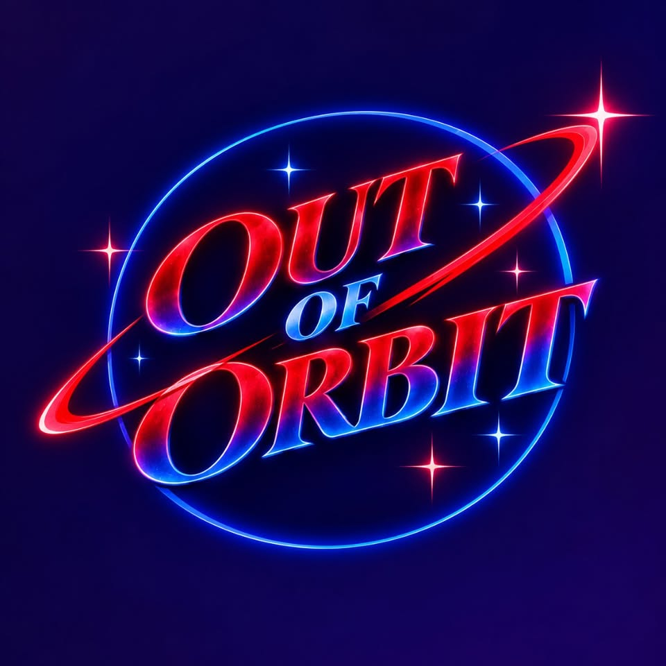

# Out of Orbit 🚀 (WMTU 91.9 FM)

The official website for **Out of Orbit**, the cosmic late-night talk show broadcasting live on **WMTU 91.9 FM** (Michigan Tech Student Radio in Houghton, MI) and streaming on Twitch at [twitch.tv/wmtu_live](https://twitch.tv/wmtu_live).



## 🌌 Features
- **Live Broadcast Command Center**: Embedded Twitch stream + WMTU 91.9 FM radio stream with interactive audio visualizer.
- **Podcast & Episode Vault**: Searchable transmission logs and playback.
- **Cosmic Studio Soundboard**: 8 tactile synthesizer pads (Web Audio API) with keyboard hotkeys (`1`–`8`).
- **Real-Time Countdown**: Live timer counting down to the next Friday 8:00 PM EDT transmission.
- **Listener Transmission Beam**: On-air hotline form for audience topics and questions.
- **Social Translink**: Connected to Twitch, [wmtu.fm](https://wmtu.fm), Instagram, Twitter/X, Discord, and SoundCloud.

## 🛠️ Tech Stack
- **Structure & Semantics**: HTML5 with rich SEO metadata & OpenGraph cards
- **Styling**: Vanilla CSS3 with responsive glassmorphism & neon synthwave aesthetics
- **Interactive FX**: HTML5 Canvas (Starfield & audio spectrum), Web Audio API (Procedural sound synthesis)

## 🚀 Running Locally
Simply open `index.html` in your browser, or start a local server:

```bash
# Using Python
python -m http.server 3000

# Or using Node
npx serve .
```
